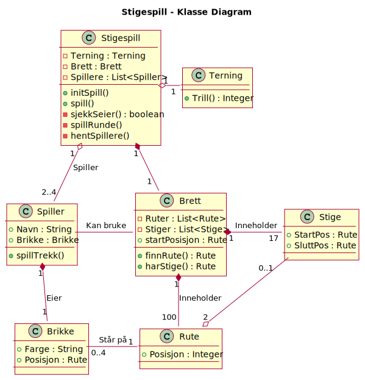

# Beksrivelser for Stigespill

## Brukstilfeller

1. Initialiser spill
2. Start spill
3. Spillerne gjør sine trekk (En runde)
   1. Trill terning
   2. Flytt brikke fram tilsvarende terningskast
4. Gjenta fra 3 til spillet er ferdig (En spiller når rute nr 100)

## Aktivitetsdiagram

## OOA - Domenemodell

Konsepter:

- Brett
- Rute(100)
- Slange
- Stige
- Spiller
- Brikke(2-4)
- Terning
- Stigespill

## Sekvensdiagram

